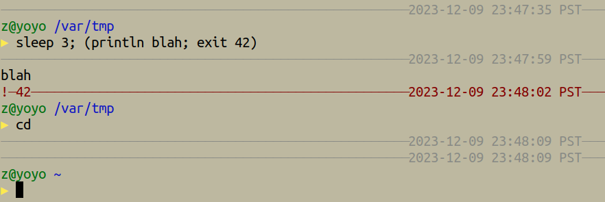

# My User Home Directory Configuration

As used for my personal laptop.

## Noteworthy Aspects

- Some configuration for tools, and some unique abilities, some of which (but
  not all) are described below.

---

- Substantial Emacs configuration with workarounds for prominent bugs in [TRAMP](https://github.com/DerickEddington/dotfiles/blob/4d4f8663f81fdad2db72266a3a3b7ecf602e21e9/.config/emacs/my/init/tramp.el#L28-L29), [LSP](https://github.com/DerickEddington/dotfiles/blob/4d4f8663f81fdad2db72266a3a3b7ecf602e21e9/.config/emacs/my/init/lsp.el#L16-L28), and [Magit](https://github.com/DerickEddington/dotfiles/blob/4d4f8663f81fdad2db72266a3a3b7ecf602e21e9/.config/emacs/my/init/magit.el#L22-L23).

- Custom Bash [history handling](https://github.com/DerickEddington/dotfiles/tree/main/.config/my/bash/interactive/history) that archives each session's [separately](https://github.com/DerickEddington/dotfiles/blob/4d4f8663f81fdad2db72266a3a3b7ecf602e21e9/.config/my/bash/interactive/history/init.bash#L43) while still starting each session with its [initial history](https://github.com/DerickEddington/dotfiles/blob/4d4f8663f81fdad2db72266a3a3b7ecf602e21e9/.config/my/bash/interactive/history/init.bash#L117) being the combined histories of all sessions.  The grouping of each session's history is preserved in the combined.  Removal of duplicates and of user-specified ignores [is done](https://github.com/DerickEddington/dotfiles/blob/4d4f8663f81fdad2db72266a3a3b7ecf602e21e9/.config/my/bash/interactive/history/init.bash#L178) in the combined.  Extra effort is made to be robust with [multiple concurrent](https://github.com/DerickEddington/dotfiles/blob/4d4f8663f81fdad2db72266a3a3b7ecf602e21e9/.config/my/bash/interactive/history/init.bash#L86) sessions and with [other](https://github.com/DerickEddington/dotfiles/blob/4d4f8663f81fdad2db72266a3a3b7ecf602e21e9/.config/my/bash/interactive/history/init.bash#L181) [aspects](https://github.com/DerickEddington/dotfiles/blob/4d4f8663f81fdad2db72266a3a3b7ecf602e21e9/.config/my/bash/interactive/history/init.bash#L202).

- Custom Bash [prompt](https://github.com/DerickEddington/dotfiles/blob/main/.config/my/bash/interactive/prompt.bash).

  

- Partitioning of SSH multiplexing, so that particular functionalities benefit
  from connection sharing within a specific functionality, but so that sharing
  is not done across separate functionalities in order to avoid one's
  accidentally crashing another's connections.  This is configured [for Emacs](https://github.com/DerickEddington/dotfiles/blob/main/.config/emacs/my/lib/my-ssh.el) for TRAMP's [`/ssh:`](https://github.com/DerickEddington/dotfiles/blob/4d4f8663f81fdad2db72266a3a3b7ecf602e21e9/.config/emacs/my/lib/my-tramp.el#L34) and [`/vagrant:`](https://github.com/DerickEddington/dotfiles/blob/4d4f8663f81fdad2db72266a3a3b7ecf602e21e9/.config/emacs/my/lib/my-tramp.el#L68) methods, and for [`my-deploy-setup`](https://github.com/DerickEddington/dotfiles/blob/4d4f8663f81fdad2db72266a3a3b7ecf602e21e9/.local/bin/my-deploy-setup#L72), and for [optional general](https://github.com/DerickEddington/dotfiles/blob/4d4f8663f81fdad2db72266a3a3b7ecf602e21e9/.ssh/config#L50) use.

- [GDB commands](https://github.com/DerickEddington/dotfiles/blob/main/.config/gdb/my/cov)
  for generating LLVM (Clang, Rust, etc.) code-coverage reports
  multiple times before a process exits, which is useful to see the current
  coverage of a program before something else happens to it, and which is useful
  when injecting function calls (and other alterations) via GDB to conduct
  spontaneous tests and iteratively exploring the coverage effects.

- Automatic setup of GDB [to find](https://github.com/DerickEddington/dotfiles/blob/4d4f8663f81fdad2db72266a3a3b7ecf602e21e9/.config/gdb/my/platform.py#L57) debug-info and source-code in dedicated per-user or system-wide temporary directories, including for non-Home-Manager non-NixOS platforms.

---

- Can deploy itself to a remote user's home directory, in various POSIX OSs, by invoking a [single command](https://github.com/DerickEddington/dotfiles/blob/main/.local/bin/my-deploy-setup) that automates [bootstrapping](https://github.com/DerickEddington/dotfiles/tree/main/.local/share/my/deploy-setup/bootstrap) this.  Desirable for easily having my personal setup in different hosts.  This command is automatically invoked for my [Vagrant VMs](https://github.com/DerickEddington/dotfiles/blob/4d4f8663f81fdad2db72266a3a3b7ecf602e21e9/.local/share/my/platform/Vagrantfile#L22), and is also intended to be invoked for remote machines (e.g. manually when working with preexisting machines of a company, or automatically (or manually) when provisioning a new machine).

- Platform-specific detection that [installs packages](https://github.com/DerickEddington/dotfiles/blob/main/.local/bin/my-install-desired-packages) and [configures things](https://github.com/DerickEddington/dotfiles/tree/main/.config/my/deploy-setup/hooks) to be the [same or similar](https://github.com/DerickEddington/dotfiles/blob/main/.config/my/platform/config.bash) in different OSs.  Based on a [pathname scheme](https://github.com/DerickEddington/dotfiles/tree/main/.local/share/my/platform) for uniformly and hierarchically locating platform-specific and architecture-specific parts, based on a [scheme for identifying](https://github.com/DerickEddington/dotfiles/blob/4d4f8663f81fdad2db72266a3a3b7ecf602e21e9/.local/share/my/sh/helpers.sh#L309) different platforms.

- Currently supports: `FreeBSD`, `Linux/Alpine`, `Linux/Debian`, `Linux/NixOS`, `Linux/Ubuntu`,
  and `SunOS/OpenIndiana`.  Further support for other POSIX OSs can be added in the future.

- Works when a home directory is simultaneously shared across [multiple machines](https://github.com/DerickEddington/dotfiles/blob/4d4f8663f81fdad2db72266a3a3b7ecf602e21e9/.config/my/env/profile.sh#L112) of different OSs and different CPU architectures.  The installation and configuration of some tools is also setup to work for this, e.g.   [GDB's](https://github.com/DerickEddington/dotfiles/blob/4d4f8663f81fdad2db72266a3a3b7ecf602e21e9/.config/gdb/my/platform.py#L51), [Cargo's](https://github.com/DerickEddington/dotfiles/blob/4d4f8663f81fdad2db72266a3a3b7ecf602e21e9/.config/my/env/profile.sh#L185), [Emacs'](https://github.com/DerickEddington/dotfiles/blob/4d4f8663f81fdad2db72266a3a3b7ecf602e21e9/.config/emacs/my/early-init.el#L25), and [some](https://github.com/DerickEddington/dotfiles/blob/4d4f8663f81fdad2db72266a3a3b7ecf602e21e9/.local/share/my/platform/packages.bash#L450) [others](https://github.com/DerickEddington/dotfiles/blob/4d4f8663f81fdad2db72266a3a3b7ecf602e21e9/.local/share/my/platform/packages.bash#L579).

---

- When in NixOS, incorporates [Home
  Manager](https://github.com/nix-community/home-manager), with configuration
  for MATE Desktop, Firefox, Emacs, Rust, [and more](https://github.com/DerickEddington/dotfiles/tree/main/.config/home-manager/common).

- When in NixOS, integrates with, and uses some of the options of, my [NixOS
  configuration](https://github.com/DerickEddington/nixos-config).  Provides the
  "skeleton" for new user's home directories, giving reproducible consistent
  user environments that can be tailored per-user.

- When in NixOS, provides extra support for debugging of binaries (executables &
  libraries) installed by Nix packages (pre-built w/o rebuilding or
  locally-built) according to [your choice](https://github.com/DerickEddington/dotfiles/blob/4d4f8663f81fdad2db72266a3a3b7ecf602e21e9/.config/home-manager/home.nix#L46).  Options for Home Manager [to configure](https://github.com/DerickEddington/dotfiles/blob/main/.config/home-manager/common/debugging.nix) all this.

---

- When in OpenIndiana (and potentially Oracle Solaris), has [tools](https://github.com/DerickEddington/dotfiles/blob/4d4f8663f81fdad2db72266a3a3b7ecf602e21e9/.config/my/platform/config.bash#L60-L61) [installed](https://github.com/DerickEddington/dotfiles/blob/4d4f8663f81fdad2db72266a3a3b7ecf602e21e9/.local/share/my/platform/packages.bash#L443), enabled via building with [my patches](https://github.com/DerickEddington/dotfiles/tree/main/.local/share/my/platform/SunOS/OpenIndiana), that are [not](http://pkg.openindiana.org/hipster/en/index.shtml) usually available for this platform.

---

- This repository enables both: sharing changes between multiple users (via the
  `main` branch), and tracking private per-user dot-files (in private per-user
  branches).

- [Companion support
  script](https://github.com/DerickEddington/nixos-config/blob/main/users/setup-home)
  for easily setting this up for new users, with hidden `~/.git` so that home
  directories normally do not appear as repositories (which is normally
  undesirable).  The dot-files remain a working-tree checkout of each user's
  repository.

- [Companion
  command](https://github.com/DerickEddington/dotfiles/blob/main/.local/bin/with-unhidden-gitdir)
  for temporarily unhiding `~/.git`, for working on dot-files changes.
